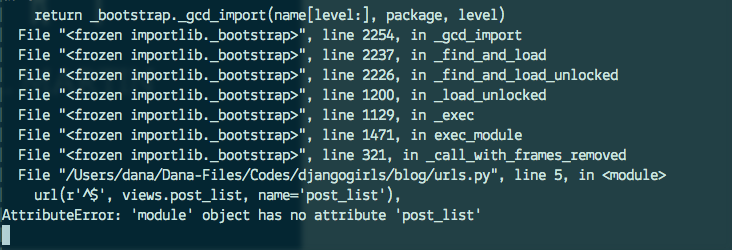

# Django URLs

Готови сме да създадем нашата първа уеб страница: начална страница на твоя блог! Но първо нека научим малко повече за Django URLs.

## Какво е URL?

URL е уеб адрес. Може да видиш URL всеки път когато посещаваш уебсайт – видимо е в полето за адрес на твоята търсачка. (Да! `127.0.0.1:8000` е URL! И `https://djangogirls.org` също е URL.)


Всяка страница в Internet има нужда от собствен URL. По този начин твоето приложение знае какво трябва да покаже на потребителя, който отваря този URL. В Django използваме нещо наречено `URLconf` (URL конфигурация). URLconf е пакет от примери, които Django се опитва да съпостави със запитания URL за да намери правилния изглед.

## Как работят URL в Django?

Нека отворим файла `mysite/urls.py` в редактора си и видим как изглежда:

mysite/urls.py

```python
"""mysite URL Configuration

[...]
"""
from django.contrib import admin
from django.urls import path

urlpatterns = [
    path('admin/', admin.site.urls),
]
```

Както може да видите, Django вече е сложил нещо за нас тук.

Редовете между трите кавички (`'''` or `"""`) се наричат docstrings – може да ги изписвате в началото на файла, класове или методи за да обясните какво прави кода - като коментар. Те няма да се изпълнят от Python.

Администртивния URL, който посетихте в предната глава е вече тук:

mysite/urls.py

```python
    path('admin/', admin.site.urls),
```

Този ред означава, че за всеки URL, който започва с `admin/`, Django ще намери съответстващ изглед *view*. В този случай въвеждаме много администраторски URL, така че да не е претъпкано в този малък файл – по-четимо и по-чисто.

## Твоя първи Django URL!

Време е да създадете вашия първи URL! Искаме 'http://127.0.0.1:8000/' да бъде началната страница на нашия блог и да показва лист от публикации.

Също така искаме да задържим файла `mysite/urls.py` чист, така че да въведем URL от нашата `blog` апликация към главният файл `mysite/urls.py`.

Давайте напред, като добавите ред с който ще въведете `blog.urls`. Също ще искате да направите промени в `from django.urls…` реда, защото използваме функция `include`, така че вие трябва да добавите `import` към този ред.

Вашият файл `mysite/urls.py` трябва да изглежда ето така:

mysite/urls.py

```python
from django.contrib import admin
from django.urls import path, include

urlpatterns = [
    path('admin/', admin.site.urls),
    path('', include('blog.urls')),
]
```

Django сега ще пренасочва всичко, което идва към 'http://127.0.0.1:8000/' до `blog.urls` и търси за следващи инструкции тук.

## blog.urls

Създайте нов файл с име `urls.py` в директория на `blog` и го отворете с редактора си. И така! Добавете следните два реда:

blog/urls.py

```python
from django.urls import path
from . import views
```

Тук въвеждаме функцията на Django `path` и всички наши изгледи ( `views`) от `blog` апликацията. (Все още нямаме никакви, но ще стигнем до там след минута!)

След това можем да добавим наши първи URL образец:

blog/urls.py

```python
urlpatterns = [
    path('', views.post_list, name='post_list'),
]
```

Както виждате, сега приписваме изгледа наречен `post_list` към началния (root) URL. Този URL образец ще съвпадне с празен низ и преобразувателя в Django URL ще игнорира домейн името (т.е.,http://127.0.0.1:8000/), което започва с пълния път на URL. Този образец казва на Django, че `views.post_list` е правилното място да отиде, ако някой влезе в сайта ви на адрес 'http://127.0.0.1:8000/'.

Последната част, `name='post_list'</0, е името на URL, което ще бъде използване за идентифициране на изгледа. Това може да е също като името на изгледа, но може да е и нещо съвсем различно. Ние ще използваме именованите URL по-късно в нашият проект, тъй като е важно да се дадат имена на всеки URL в приложението. Също трябва да се опитаме да запазим имената на URL униканлни и лесни за запомняне.</p>

<p>Ако сега се опитате да посетите http://127.0.0.1:8000/, ще видите съобщение от рода на 'web page not available' . Това е така, защото сървърът (помните командата <code>runserver`?) вече не е активен. Погледнете в конзолата на сървъра си и разберете защо.



Конзолата ви показва грешка, но не се тревожете – това всъщност е много полезно: Казва ви, **че няма атрибут с име 'post_list'**. Това е името на изгледа, който Django се опитва да намери и използва, но ние не сме го създали все още. На този етап, вашият `/admin/` също няма да работи. Не се тревожете – ще стигнем и до там. Ако виждате съобщение с друга греша, опитайте се да презаредите уеб сървъра. За да направите това, в конзолния прозорец, където сте пуснали сървъра, натиснете Ctrl+C за да го спрете (Ctrl + C заедно). На Windows може би трябва да натиснете Ctrl+Break. След това трябва да презаредите уеб сървъра като напишете командата `python manage.py runserver`.

> Ако искате да научите повече за Django URLconfs, вижте в официалната документация: https://docs.djangoproject.com/en/2.2/topics/http/urls/