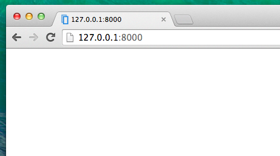
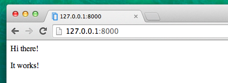
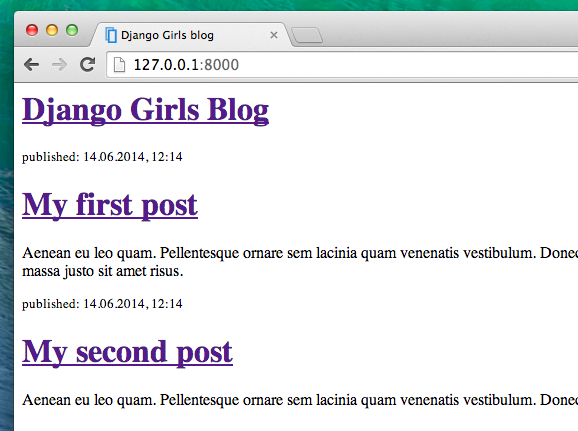

# Въвeдение в HTML

Може би се питате какво е шаблон (template)?

Шаблонът е файл който, можем да използваме неколкократно за да представим различна информация в последователен формат -- например, можете да използвате шаблон, който да ви помага да напишете писмо, защото макар че всяко писмо да може да съдържа различно съобщение и да бъде адресирано до различен човек, те ще споделят същия формат.

Django формат шаблона е описан в език наречен HTML (Това е HTML, който споменахме в главата **Как работи Internet**).

## Какво е HTML?

HTML е код, който се интерпретира от търсачките -- като Chrome, Firefox, Safari -- за да покаже на екран страницата на потребителя.

HTML идва от "HyperText Markup Language". **HyperText** означава, че е тип от текст който подпомага хипервръзки между страници. **Markup** означава, че сме взели документа и сме го означили с код за да кажем нещо (в този случай, търсачка) как да подразбира страницата. HTML кода е изграден от **tags** (етикети), всеки от които стартира с `<` и завършва с `>`. Тези етикети представляват маркирани елементи (**elements**).

## Първият ви шаблон!

Създаване на шаблон означава създаване на шаблонен файл. Всичко е файл, нали? Може би вече забелязахте това.

Шаблоните се запазват в директория `blog/templates/blog`. Така че, първо създайте директория наречена `templates` в директорията на блога ви. След това създайте друга директория наречена `blog` вътре при вашите шаблони:

    blog
    └───templates
        └───blog
    

(Може би се чудите защо са ни нужни две директории наречени `blog` -- както ще откриете по-късно, това е много лесно установена практика, която прави живота ни по-лесен, когато нещата започват да стават по-сложни.)

И сега създайте файл `post_list.html` (оставете го празен засега) в директорията `blog/templates/blog`.

Вижте как изглежда сайта ви: http://127.0.0.1:8000/

> Ако все още имате грешка `TemplateDoesNotExist`, опитайте се да заредите сървъра си отново. Отидете в конзолата си, спрете сървъра като натиснете едновременно Ctrl+C и го стартирате отново като напишете команда `python manage.py runserver` .



Вече нямаме грешка! Поздравления :) Въпреки това, сайта ви всъщност не публикува нищо освен празна страница, защото шаблонът ви също е празен. Можем да оправим това.

Отворете новият файл в редактора и добавете следното:

blog/templates/blog/post_list.html

```html
<html>
<body>
    <p>Hi there!</p>
    <p>It works!</p>
</body>
</html>
```

Така, как изглежда уебсайта ви в момента? Отидете на: http://127.0.0.1:8000/ за да разберете



Работи! Добра работа :)

* Най-простия етикет `<html>` е винаги в началото на една страница и `</html>` е винаги в края и. Както може да видите, цялото съдържание на страницата е между отварящият `<html>` и затварящият етикет `</html>`
* `<p>` е етикет за абзацни елементи; `</p>` затваря всеки един абзац

## Глава и тяло на страницата (head и body)

Всяка HTML страница е разделена на два елемена: **head** и **body**.

* **head** е елемент, който съдържа информация относно документа, който е показан на екрана.

* **body** е елемент, който съдържа всичко, което е показано като част от уеб страницата.

Използваме `<head>` за да кажем на търсачката за конфигурацията на страницата и `<body>` какво точно е на страницата.

Например, може да сложите заглавие на елемента вътре в `<head>` ето така: 

blog/templates/blog/post_list.html

```html
<html>
    <head>
        <title>Ola's blog</title>
    </head>
    <body>
        <p>Hi there!</p>
        <p>It works!</p>
    </body>
</html>
```

Запазете файла и презаредете страницата.


Забелязахте ли как търсачката ви разбра, че заглавието на блога е "Ola's blog"? Тълкува `<title>Ola's blog</title>` и показва текст с името на заглавието в лентата на търсачката (също така ще се използва за отметка (bookmarks) и т.н.).

Вероятно забелязахте и, че отварящия етикет съвпада със затварящия с `/`, като тези елементи са вложени (например не можете да затворите определен етикет, докато не затворите всички, които са преди него).

Също като да слагаме неща в кутии. Имате една голяма кутия, `<html></html>`; в нея е `<body></body>` и това съдържа други по-малки кутии: `<p></p>`.

Трябва да следвате тези правила със затварящите етикети и вложените елементи - ако ли не, търсачката ви може и да не ги представи както трябва и страницата ви ще изглежда неправилно.

## Персонализиране на шаблон

Може малко да се позабавлявате и да опитате да направите свой шаблон! Ето няколко полезни етикета за целта:

* `<h1>Заглавие</h1>` за най-важното ви заглавие
* `<h2>Подзаглавие</h2>` за заглавие от следващо ниво
* `<h3>Под-подзаглавие</h3>` …и т.н. до `<h6>`
* `<p>Абзац</p>`
* `<em>текст</em>` набляга на текста 
* `<strong>текст</strong>` удебелява текста
* `<br>` отива на нов ред (не може да сложите нищо в br, както и няма затварящ етикет )
* `<a href="https://djangogirls.org">връзка</a>` създава връзка 
* `<ul><li>първи елемент</li><li>втори елемент</li></ul>` прави лист, точно като този! 
* `<div></div>` дефинира секция от страницата

Ето пример на пълен шаблон, копирайте и пренесете в `blog/templates/blog/post_list.html`:

blog/templates/blog/post_list.html

```html
<html>
    <head>
        <title>Django Girls blog</title>
    </head>
    <body>
        <div>
            <h1><a href="/">Django Girls Blog</a></h1>
        </div>

        <div>
            <p>published: 14.06.2014, 12:14</p>
            <h2><a href="">My first post</a></h2>
            <p>Aenean eu leo quam. Pellentesque ornare sem lacinia quam venenatis vestibulum. Donec id elit non mi porta gravida at eget metus. Fusce dapibus, tellus ac cursus commodo, tortor mauris condimentum nibh, ut fermentum massa justo sit amet risus.</p>
        </div>

        <div>
            <p>published: 14.06.2014, 12:14</p>
            <h2><a href="">My second post</a></h2>
            <p>Aenean eu leo quam. Pellentesque ornare sem lacinia quam venenatis vestibulum. Donec id elit non mi porta gravida at eget metus. Fusce dapibus, tellus ac cursus commodo, tortor mauris condimentum nibh, ut f.</p>
        </div>
    </body>
</html>
```

Създадохме три `div` секции тук.

* Първият `div` елемент съдържа името на блога -- неговото заглавие и връзката
* Другите два `div` елемента съдържат нашите блог постове с датата на публикуване, `h2` със заглавието, на което може да се кликне и два `p`-елемента (абзаца) от текст, единия за датата, а другия за нашия пост.

Дава ни този ефект:



Ихаа! Но дотук, нашият шаблон показва точно **същата информация** -- там където говорихме по-рано за шаблоните, които ни позволяват да показваме **различна** информация в **същия формат**.

Това, което искаме е да показва истински публикации добавени в администратора на Django -- и там е където отиваме след това.

## Още нещо: прехвърляне на файловете (deploy)!

Би било добре да видим всичко това на живо в Internet, нали? Нека направим още едно прехвърляне на файлове към PythonAnywhere:

### Запазете, and избутайте кода си към GitHub

Първо, нека видим кои файлове се промениха след последното прехвърляне (напишете следните команди на локалния компютър, не на PythonAnywhere):

command-line

    $ git status
    

Бъдете сигурни, че сте в директорията на `djangogirls` и нека кажем на git да включи всички промени в тази директория:

command-line

    $ git add --all .
    

> **Забележка** `--all` означава, че `git` ще разпознае и файлове, които сте изтрили (по подразбиране, разпознава нови/модифицирани файлове). Също помните (от 3-та глава), че `.` означава настоящата директория.

Преди да качим всички файлове, нека проверим какво ще качи `git` (всички файлове, които `git` ще качи ще се появят в зелено):

command-line

    $ git status
    

Почти сме там, сега е време да кажем да запази тези промени в хронологията си. Ще дадем съобщение за запазване ("commit message"), където описваме накратко какво сме променили. Може да напишете каквото си поискате на този етап, но е важно да се знае, че би трябвало да е нещо описващо от това, което сте направили, така че да се знае в бъдеще.

command-line

    $ git commit -m "Changed the HTML for the site."
    

> **Забележка:** Бъдете сигурни, че сте сложили съобщението в двойни кавички.

След като сме направили това, качваме (push) нашите промени на GitHub:

command-line

    $ git push
    

### Издърпайте новия код на PythonAnywhere и презаредете страницата

* Отворете [PythonAnywhere страницата](https://www.pythonanywhere.com/consoles/) и отидете на **Bash конзолата** (или стартирайте нова). След това напишете команда:

PythonAnywhere command-line

    $ cd ~/<your-pythonanywhere-domain>.pythonanywhere.com
    $ git pull
    [...]
    

Трябва да заместите `<your-pythonanywhere-domain>` с актуалния си PythonAnywhere субдомейн без скобите. Вашият субдомейн е потребителско ви име в PythonAnywhere, но в някои случай може да е различно (като например ако потребителското ви име съдържа главни букви). Така че, ако тази команда не работи, използвайте команда `ls` (показване на лист от файлове) за да намерите вашия субдомейн/име на папката, и след това да отидете в нея `cd`.

Сега гледайте как се сваля кода ви. Ако искате да проверите дали е пристигнал, отидете на **"Files" страница** и вижте кода си на PythonAnywhere (може да достигнете други страници на PythonAnywhere от бутона на менюто в страницата на конзолата).

* Накрая, отидете на ["Web" страницата](https://www.pythonanywhere.com/web_app_setup/) и натиснете **Reload** на вашата апликация.

Обновлението трябва да е на живо! Отидете и презаредете страницата си в търсачката. Промените трябва да са видими. :)