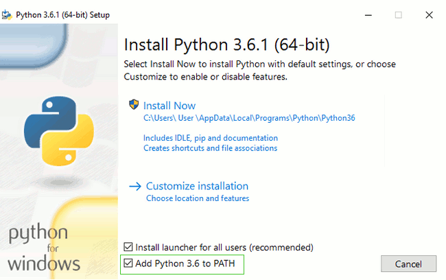

> 家で１人でこのチャプターに挑戦している方へ：この章は、動画（英語）もあるので参考にしてください。 [Installing Python & Code Editor](https://www.youtube.com/watch?v=pVTaqzKZCdA)
> 
> このセクションはGeek Girls Carrots (https://github.com/ggcarrots/django-carrots) のチュートリアルをベースに作成しました。

DjangoはPythonで書かれています。 Djangoを使うにはPythonが必要です。 では、インストールするところから始めましょう！ 最新のPython３をインストールしてください。それ以前のPythonがインストールされていたら、アップグレードする必要があります。 3.4以降のバージョンであれば問題ありません。

下に書いたとおりのやり方で、Pythonをインストールしてください。すでにAnacondaが入っていても以下のとおりにインストールしてください。

<!--sec data-title="Install Python: Windows" data-id="python_windows" data-collapse=true ces-->

まず、今使っているWindowsが32-bit版か64-bit版か確認しましょう。システム情報の”システムの種類”を確認してください。これを見る方法はいくつかあるので、次のうち１つをやってみましょう：

* WindowsキーとPause/Breakキーを同時に押します。
* Windowsのスタートからコントロールパネルを開き、”システムとセキュリティ”、”システム”と順にクリックします。
* Windowsロゴをクリック、設定 > システム > バージョン情報 とクリックしていきましょう。

https://www.python.org/downloads/windows/ からWindows版のPythonをダウンロードできます。 "Latest Python 3 Release - Python x.x.x" というリンクをクリックします。 あなたのWindowsが**64-bit版**なら、**Windows x86-64 executable installer**をダウンロードしてください。 そうでなければ**Windows x86 executable installer**をダウンロードしてください。 インストーラーがダウンロードできたら、ダブルクリックして実行し、指示に従ってください。

インストールの途中で、「Setup」というタイトルのウィンドウがでてきたら注意してください。 下にあるとおり、「Add Python 3.6 to PATH」か「Add Python to your environment variables」をチェックしてから「Install Now」をクリックしてください (バージョンが違うと表示が違うこともあります)。

インストールが終わったら、ダイアログボックスが出てきます。ボックス内のリンクを開くと、Pythonやインストールしたバージョンを説明したページに行けます。 ダイアログは閉じてしまいましょう。Pythonの使い方はこのチュートリアルでたっぷり勉強します！

注意: あなたのWindowsがWindows7、Windows Vistaや、それ以前のバージョンの場合で、Python 3.6.x のインストールがエラーがでて失敗する場合は、下のどちらかのやり方を試してください。

1. Windows Updateを実行してすべての更新ファイルを入れてから、Pythonを入れ直す
2. [古いバージョンのPython](https://www.python.org/downloads/windows/)をインストールしてみる。例えば[3.4.6](https://www.python.org/downloads/release/python-346/)。

古いバージョンのPythonをインストールした場合、インストール画面は上のものと違うことがあります。 下にスクロールして「Add python.exe to Path」の左のボタンをクリックして「Will be installed on local hard drive（ローカルハードドライブにインストールされます）」を選択してください

<!--endsec-->

<!--sec data-title="Install Python: OS X" data-id="python_OSX"
data-collapse=true ces-->

> **注意**：OS XにPythonをインストールする前に、Macの設定でApp Store以外のパッケージをインストールできるようにする必要があります。 「システム環境設定」（「アプリケーション」フォルダ内）に移動し、「セキュリティとプライバシー」、「一般」タブの順にクリックします。 「ダウンロードしたアプリを許可する」が「Mac App Store」に設定されている場合は、「Mac App Storeと識別された開発者」に変更します。

https://www.python.org/downloads/release/python-361/ からPythonインストーラーをダウンロードします。

* *Mac OS X 64-bit/32-bit installer* というファイルをダウンロードします。 
* ダウンロードできたら *python-3.6.1-macosx10.6.pkg* をダブルクリックして実行します。

<!--endsec-->

<!--sec data-title="Install Python: Linux" data-id="python_linux"
data-collapse=true ces-->

すでにPythonがインストールされているかもしれません。インストールされているか、そしてどのバージョンが入っているか確かめるには、コンソールを開いて下のコマンドを入力してください。

command-line

    $ python3 --version
    Python 3.6.5
    

表示されたバージョンが違っても、3.4.0以降(例えば 3.6.0など)であれば、アップグレードの必要はありません。 Pythonがインストールされていなかったり、違うバージョンをインストールしたい場合は、下のコマンドを実行して、まずパソコンのLinuxディストリビューションがなにか確かめてください。

command-line

    $ grep ^NAME= /etc/os-release
    

表示されたディストリビューション名に従って、以下のインストール方法の1つを実行してください。

<!--endsec-->

<!--sec data-title="Install Python: Debian or Ubuntu" data-id="python_debian" data-collapse=true ces-->

下のコマンドをコンソールに入力します。

command-line

    $ sudo apt install python3
    

<!--endsec-->

<!--sec data-title="Install Python: Fedora" data-id="python_fedora"
data-collapse=true ces-->

下のコマンドをコンソールに入力します。

command-line

    $ sudo dnf install python3
    

Fedoraのバージョンが古い場合、 `dnf` コマンドが見つからないというエラーが出るかもしれません。そんなときは代わりに `yum` コマンドを使ってください。

<!--endsec-->

<!--sec data-title="Install Python: openSUSE" data-id="python_openSUSE"
data-collapse=true ces-->

下のコマンドをコンソールに入力します。

command-line

    $ sudo zypper install python3
    

<!--endsec-->

インストールがうまくいったか確認するために、コマンドプロンプトを開いて `python3` と打ち込んでください。

command-line

    $ python3 --version
    Python 3.6.1
    

バージョンはあなたがインストールしたものが表示されます。なのでPython 3.6.1 と表示されないかもしれません。

**注意:** Windowsで `python3` を実行して、コマンドが見つからないとエラーが出た場合、代わりに `python` (`3` をコマンドに入れていません) を使ってみてください。そして、3.4.0以降のPythonのバージョンが表示されるか確認してください。 どちらのコマンドもうまく動かない場合は、新しいコマンドプロンプトを開いて同じことを試してください。Pythonのインストール前にコマンドプロンプトを使っていて、それが開きっぱなしだとこういうことが起きます。

* * *

わからないことがあったり、うまくいかなくて次にどうしたらいいかわからなかったりするときは、コーチに質問してください! うまくいかないこともあります。そういうときは、経験豊富な人に聞くといいですよ。